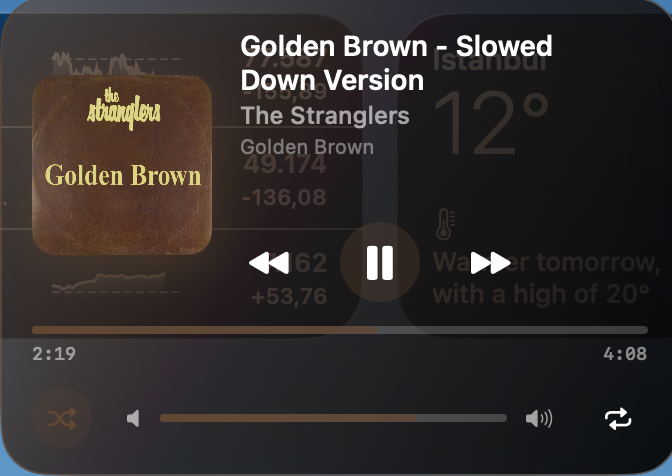

# Dynamic Music Island for macOS 🎵

A sleek, floating Dynamic Island-style music widget for macOS that displays currently playing music from any app (Spotify, Apple Music, etc.).

  
   
  
  

## Features

- **Floating Widget**: Always-on-top pill-shaped widget positioned at the top of your screen
- **Now Playing Detection**: Automatically detects music from any media app
- **Expandable UI**: Click to expand and see album art, track details, and controls
- **Playback Controls**: Play/Pause, Previous, Next track
- **Progress Bar**: Visual progress indicator for the current track
- **Animated Sound Waves**: Visual feedback when music is playing
- **File Stash / Drop Zone**: Drag and drop files onto the island to stash them temporarily
- **AirDrop Integration**: Quickly share stashed files via AirDrop directly from the island
- **Menu Bar Control**: Quick access via menu bar icon
- **Drag to Reposition**: Move the island anywhere on screen

## Requirements

- macOS 13.0 (Ventura) or later
- Xcode 15.0 or later

## Installation

1. Open the project inside the `ADADYNAMİC` folder (`ADADYNAMİC/DynamicMusicIsland.xcodeproj`) in Xcode
2. Select your development team in Signing & Capabilities (optional for personal use)
3. Build and run (⌘R)

## Permissions

The app requires the following permissions:

- **Accessibility** (optional): For global media control
- **Automation** (optional): For AppleScript fallback with Spotify

When you first run the app, macOS may ask for permission to control other apps. Grant these permissions for full functionality.

## Usage

- **Click** the island to expand/collapse
- **Drag** the island to reposition it
- **Drag and Drop Files** onto the island to open the Stash/Drop Zone
- Access the Drop Zone via the **folder icon** when hovering over the music info
- Use the **menu bar icon** to show/hide the island
- **Playback controls** appear in the expanded view

## How It Works

The app uses macOS's private `MediaRemote` framework to:
- Get now playing information from any media app
- Control playback across apps
- Receive real-time updates when tracks change

This is the same API that powers the built-in Now Playing widget in Control Center.

## Customization

You can modify the appearance in `IslandContentView.swift`:

- Change colors and gradients
- Adjust animation timing
- Modify the expanded view layout
- Change the default position

## Troubleshooting

**Island not showing music:**
- Make sure a music app is actively playing
- Try restarting the app
- Check System Preferences → Security & Privacy → Privacy → Automation

**Controls not working:**
- Grant Accessibility permissions in System Preferences
- Some apps may not respond to all media commands

## Technical Notes

- Uses `@_silgen_name` to access private MediaRemote framework
- No App Sandbox for media control access
- Falls back to AppleScript for Spotify-specific features

## License

MIT License - Feel free to modify and distribute!

---

Made with ❤️ for music lovers
