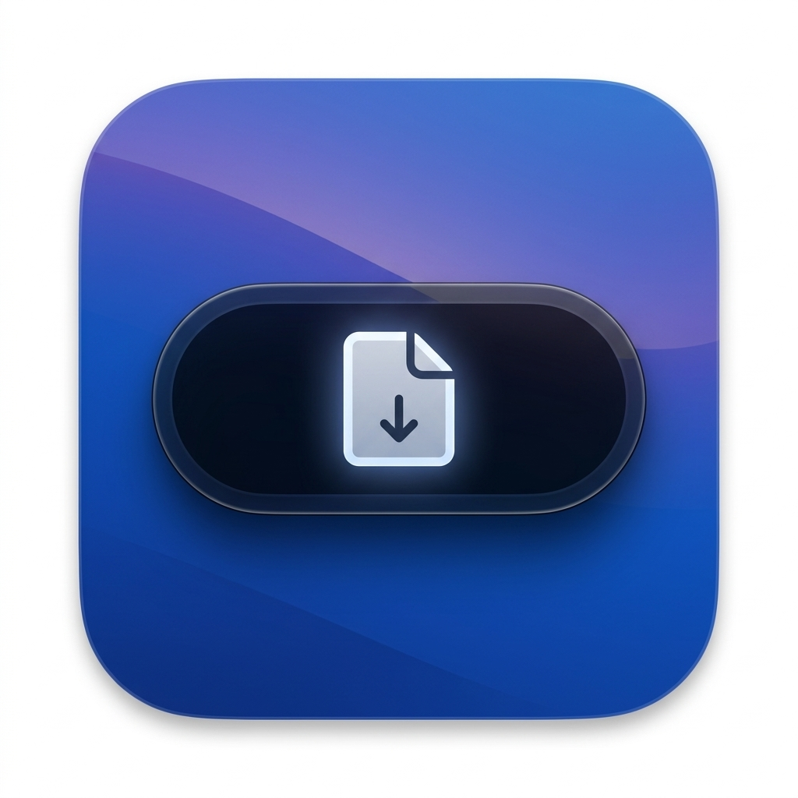
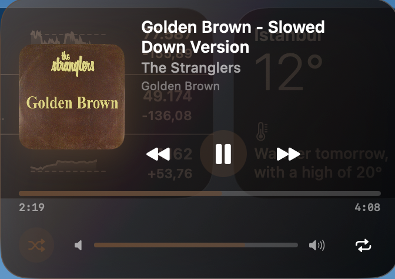

  
  <h1>Dynamic Music Island for macOS</h1>
  
<b>A sleek, notch-inspired productivity hub and media controller for your Mac.</b>

  
  

    
    
    
    
  

---

## ✨ Overview

**Dynamic Music Island** brings the elegant, liquid-smooth animations of the iOS Dynamic Island straight to your Mac's desktop. Hover over the notch to reveal media controls, drag files into it to stash them for later, or instantly share items via AirDrop. Built from the ground up for macOS Sonoma & Sequoia, with **zero background CPU usage** and **100% App Store compatibility**.

  

## 🚀 Features

### 🎵 Smart Media Controller
- **Multi-Source Detection:** Instantly syncs with Apple Music, Spotify, and Safari (YouTube Music, YouTube, Web Spotify, Amazon Music).
- **Liquid Physics:** Beautiful, spring-loaded expanding animations when hovering or clicking.
- **Ambient Glow:** The island radiates colors extracted directly from the playing album artwork.
- **Waveform Visualizer:** Animated sound waves that respond to playback status.

### 📁 Productivity Hub & Notch Tray
- **Drag & Drop Stash:** Drag files from Finder straight into the notch. They're safely stashed in your Tray.
- **Instant AirDrop:** Drop files into the AirDrop zone for a seamless, native macOS sharing experience.
- **App Shortcuts:** Drag applications into the notch to build your own Quick Launch dock.

### 🧩 Dynamic Mini-Widgets
- **Web Browser:** A fully functional, resizable floating mini-browser for quick searches.
- **Live Camera Mirror:** Check your hair/makeup with the FaceTime camera before jumping into a meeting.
- **Weather & Calendar:** Real-time metrics sitting elegantly in your notch.
- **Battery Status:** Live battery percentage and charging state directly via IOKit.

---

## 🛠 Architecture & Performance

Engineered for the absolute highest macOS standards:
- **Zero Polling (0.0% CPU):** Driven entirely by event-based Combine publishers, `NSWorkspace` observers, and Distributed Notifications. No wasteful timers.
- **100% MAS Compliant:** Uses zero private APIs. Strict adherence to Apple's App Store Guidelines (Sandbox, Automation Entitlements).
- **Strict Concurrency:** Built with Swift 6 strict concurrency (`@MainActor`, Sendable) for crash-free thread safety.

## 💻 Requirements
- **OS:** macOS 14.0 (Sonoma) or newer.
- **Hardware:** Works beautifully on MacBooks with hardware notches, and automatically adapts to a "Floating Pill" design on external notchless displays.

## 🔐 Licensing & Copyright

**Proprietary Software**  
Copyright © 2026 Bilge Kagan Pamuk. All Rights Reserved.

This software is strictly proprietary. You may not copy, modify, distribute, or commercialize this code, its assets, or any derivatives without explicit written permission from the author. 

---

  <i>Designed and developed by Bilge Kagan Pamuk.</i>

